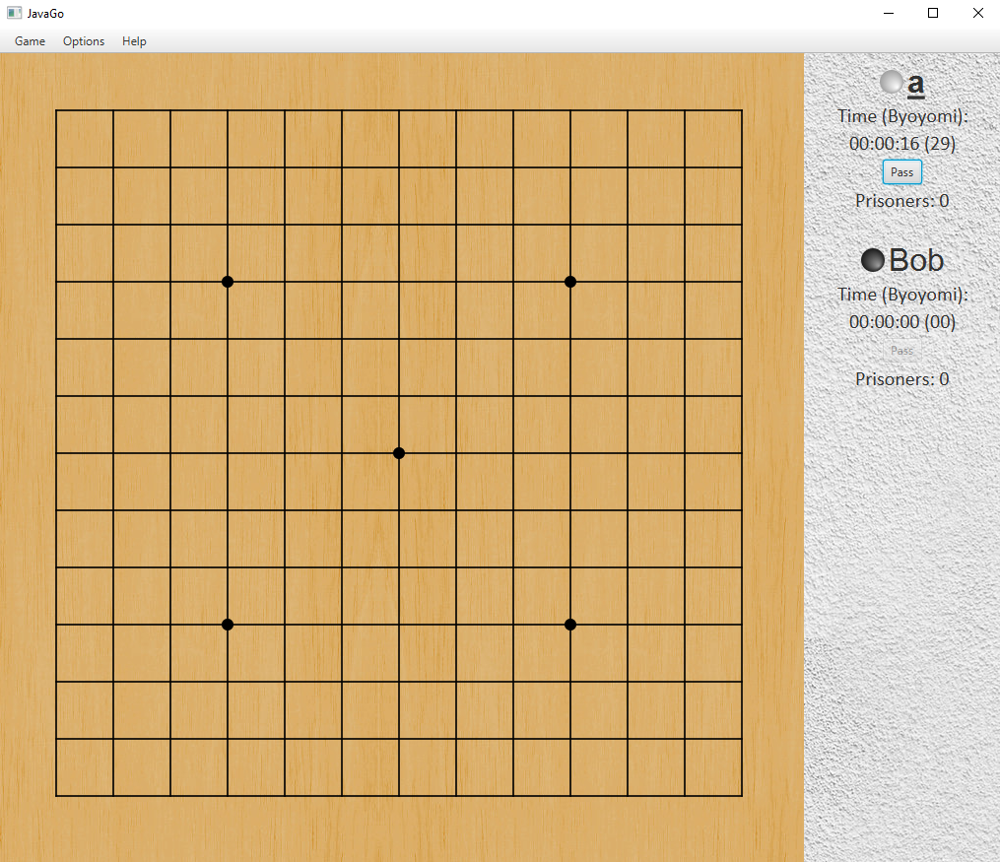

# JavaGo
Java implementation of Go game.
Basic game & replay is implemented, scoring is manual, network game is not yet implemented.

# This project is not in active development, please feel free to get inspired by it and if you have some ideas how to improve the game, feel free to contact me I might find time to implement it.

